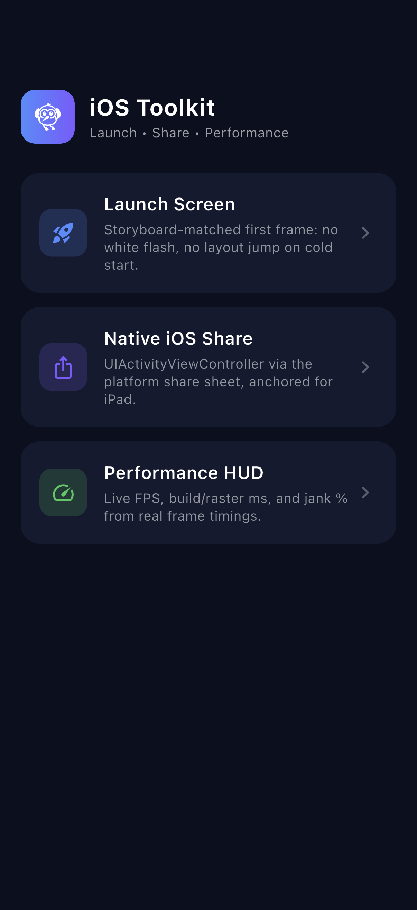
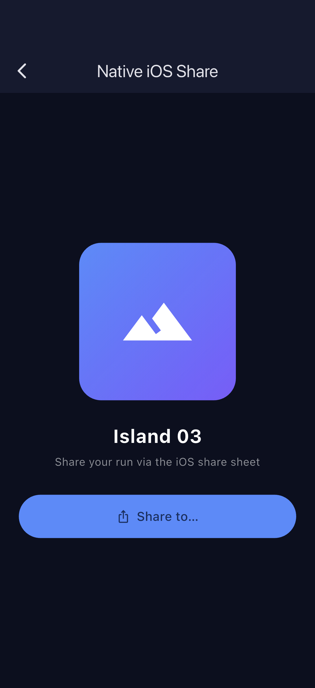
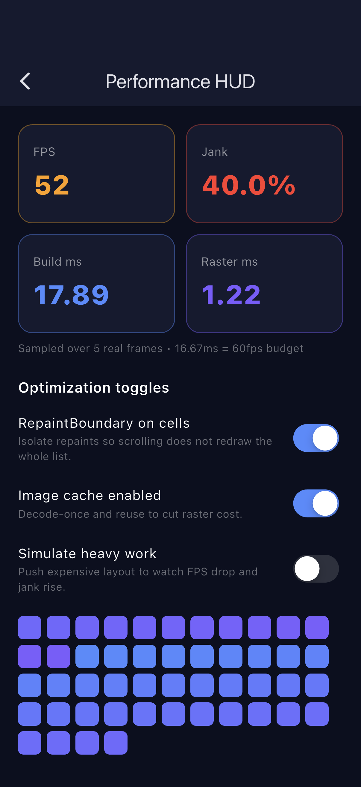

# flutter_ios_launch_share_perf

A focused Flutter + Riverpod POC for the **iOS-specific** polish work an app needs before shipping: a storyboard-matched launch screen, the native iOS share sheet, and a live performance/optimization HUD driven by real frame timings.

Built to demonstrate the iOS-side skills behind tuning an app (e.g. an Unreal/iPad title) on device: launch screen, iOS share, and optimization.

## Screenshots

| Home | Native iOS share | Performance HUD |
| --- | --- | --- |
|  |  |  |

## What it shows

- **Launch screen, no flash** - `ios/Runner/Base.lproj/LaunchScreen.storyboard` is recoloured to the exact app background so the cold-start storyboard and the Flutter first frame are visually identical (no white flash, no layout jump).
- **Native iOS share** - `share_plus` drives `UIActivityViewController`, with `sharePositionOrigin` wired to the button's rect so the iPad popover anchors correctly (the usual iPad share crash).
- **Live performance HUD** - subscribes to `SchedulerBinding.addTimingsCallback` and reduces real `FrameTiming`s into rolling **FPS**, average **build ms** / **raster ms**, and **jank %** against the 16.67ms (60fps) budget.
- **Optimization toggles** - `RepaintBoundary`, image cache, and a "simulate heavy work" switch flip a controllable render load so you can watch the metrics react.

## Architecture

- **Flutter** + **Riverpod** (`Notifier` / `NotifierProvider`)
- `lib/src/perf_provider.dart` - frame-timing stream + optimization options
- `lib/src/share_screen.dart` - native share with iPad anchor
- `lib/src/perf_screen.dart` - HUD + toggles + stress grid

## Run

```bash
flutter pub get
flutter run -d ios
```

See [`FLOW.md`](FLOW.md) for the screenshot-capture flow.
